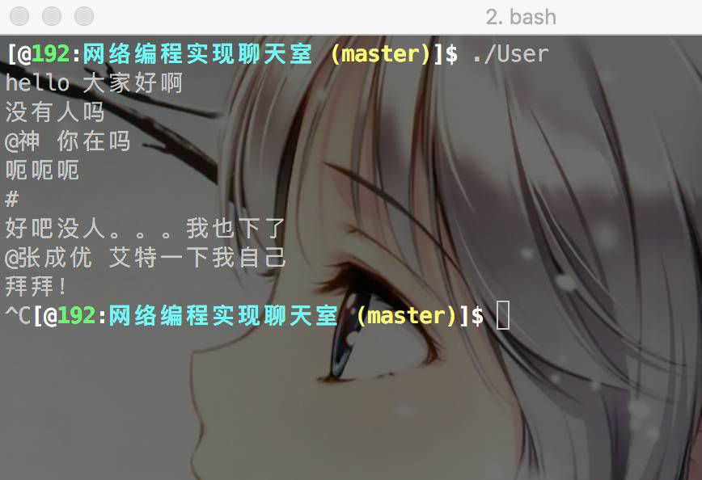
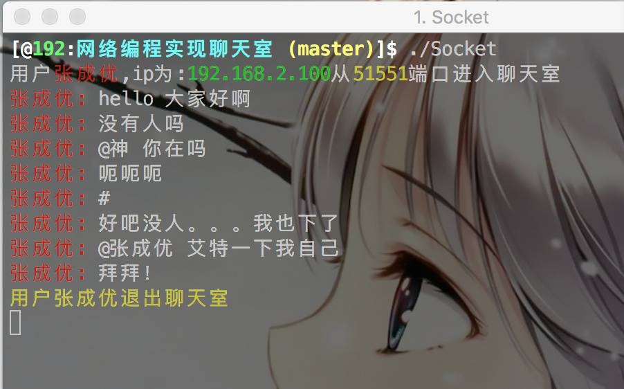
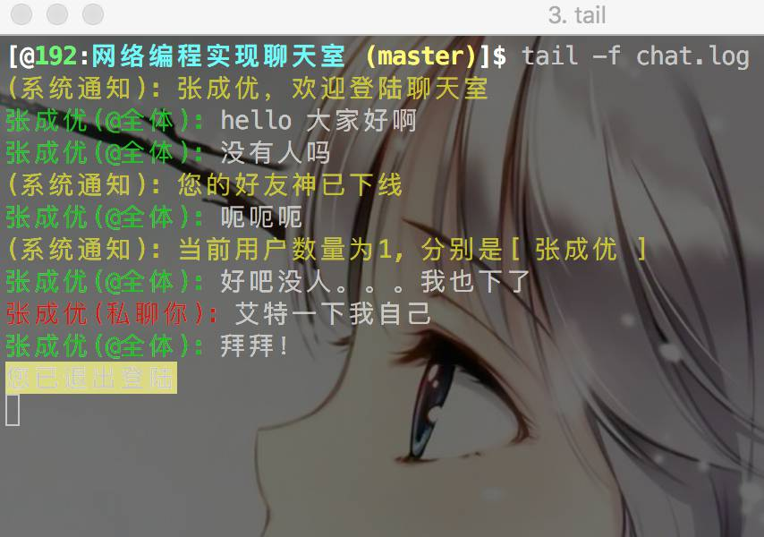

主要是利用所学网络编程来实现聊天室功能，包括客户端和服务端两个部分。

### 客户端

客户端的内容如下：

1. 使用配置文件配置自己的监听端口，服务器的监听端口等信息

2. 用户之间可以通过"@用户名 信息"来实现私聊

3. 客户端在一个固定端口上监听服务器转发的来自其他用户的私聊、公聊以及系统信息

4. 客户端所接受到的所有信息保存日志文件中，可利用tail -f 文件名获取实时聊天信息

5. 客户端解析来自服务端的结构体，内容如下：

```
struct Message{  
 char from[20];  
 int flag;//若flag为1则为私聊信息，0为公聊信息，2则为服务器的通知信息  
 char message[1024]; 
};
```


###服务端

1. 服务端在固定接口接收来自所有客户端的消息

2. 每收到一条公聊消息，都转发给所有在线用户

3. 每收到私聊消息，只转发给目标用户

4. 当私聊用户不存在或下线，通过通知信息告知该用户

5. 在用户上线的时候，发送欢迎信息并告知所有在线用户该用户上线

6. 在收到用户信息#时，发送给该用户当前在线人数以及所有用户信息

    

具体效果如下：

用户界面：



服务端界面：



用户的log日志显示：

